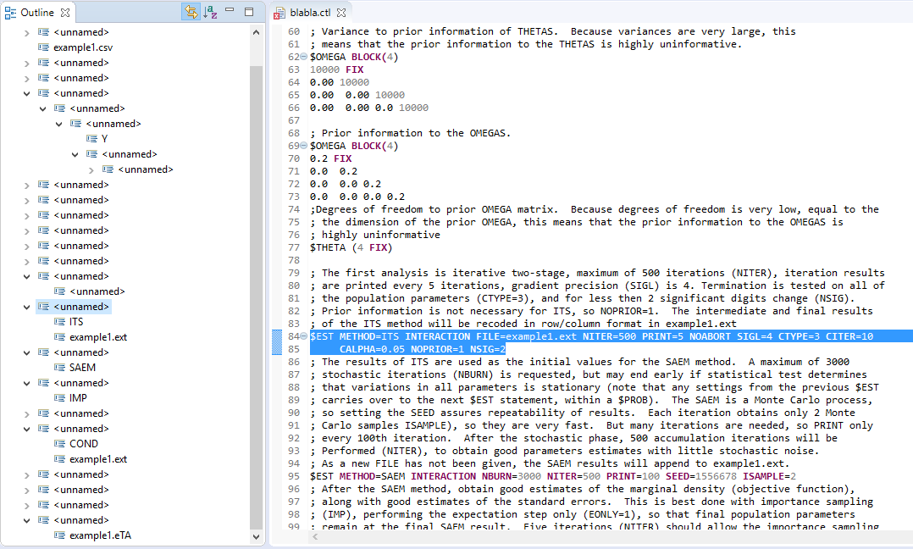

# Demonstration of current capabilities

## Demo file

```
;Model Desc: Two compartment Model, Using ADVAN3, TRANS4
;Project Name: nm7examples
;Project ID: NO PROJECT DESCRIPTION

$PROB RUN# Example 1 (from samp5l)
$INPUT C SET ID JID TIME  DV=CONC AMT=DOSE RATE EVID MDV CMT CLX V1X QX V2X SDIX SDSX
$DATA example1.csv IGNORE=C

$SUBROUTINES ADVAN3 TRANS4

;NTHETA=number of Thetas to be estimated
;NETA=number of Etas to be estimated (and to be described by NETAxBETA OMEGA matrix)
;NTHP=number of thetas which have a prior
;NETP=number of Omegas with prior
;Prior information is important for MCMC Bayesian analysis, not necessary for maximization
; methods
$PRIOR NWPRI NTHETA=4, NETA=4, NTHP=4, NETP=4

$PK
; The thetas are MU modeled.  Best that there is a linear relationship between THETAs and Mus
;  The linear MU modeling of THETAS allows them to be efficiently Gibbs sampled.
MU_1=THETA(1)
MU_2=THETA(2)
MU_3=THETA(3)
MU_4=THETA(4)
CL=DEXP(MU_1+ETA(1))
V1=DEXP(MU_2+ETA(2))
Q=DEXP(MU_3+ETA(3))
V2=DEXP(MU_4+ETA(4))
S1=V1

$ERROR
Y = F + F*EPS(1)

; Initial values of THETA
$THETA 
(0.001, 2.0) ;[LN(CL)]
(0.001, 2.0) ;[LN(V1)]
(0.001, 2.0) ;[LN(Q)]
(0.001, 2.0) ;[LN(V2)]
;INITIAL values of OMEGA
$OMEGA BLOCK(4)
0.15   ;[P]
0.01  ;[F]
0.15   ;[P]
0.01  ;[F]
0.01  ;[F]
0.15   ;[P]
0.01  ;[F]
0.01  ;[F]
0.01  ;[F]
0.15   ;[P]
;Initial value of SIGMA
$SIGMA 
(0.6 )   ;[P]

; Prior information of THETAS
$THETA (2.0 FIX) (2.0 FIX) (2.0 FIX) (2.0 FIX)

; Variance to prior information of THETAS.  Because variances are very large, this
; means that the prior information to the THETAS is highly uninformative.
$OMEGA BLOCK(4)
10000 FIX 
0.00 10000
0.00  0.00 10000
0.00  0.00 0.0 10000

; Prior information to the OMEGAS.
$OMEGA BLOCK(4)
0.2 FIX 
0.0  0.2 
0.0  0.0 0.2
0.0  0.0 0.0 0.2
;Degrees of freedom to prior OMEGA matrix.  Because degrees of freedom is very low, equal to the
; the dimension of the prior OMEGA, this means that the prior information to the OMEGAS is
; highly uninformative
$THETA (4 FIX)

; The first analysis is iterative two-stage, maximum of 500 iterations (NITER), iteration results
; are printed every 5 iterations, gradient precision (SIGL) is 4. Termination is tested on all of
; the population parameters (CTYPE=3), and for less then 2 significant digits change (NSIG).
; Prior information is not necessary for ITS, so NOPRIOR=1.  The intermediate and final results
; of the ITS method will be recoded in row/column format in example1.ext
$EST METHOD=ITS INTERACTION FILE=example1.ext NITER=500 PRINT=5 NOABORT SIGL=4 CTYPE=3 CITER=10   
     CALPHA=0.05 NOPRIOR=1 NSIG=2
; The results of ITS are used as the initial values for the SAEM method.  A maximum of 3000
; stochastic iterations (NBURN) is requested, but may end early if statistical test determines
; that variations in all parameters is stationary (note that any settings from the previous $EST
; carries over to the next $EST statement, within a $PROB).  The SAEM is a Monte Carlo process,
; so setting the SEED assures repeatability of results.  Each iteration obtains only 2 Monte
; Carlo samples ISAMPLE), so they are very fast.  But many iterations are needed, so PRINT only
; every 100th iteration.  After the stochastic phase, 500 accumulation iterations will be
; Performed (NITER), to obtain good parameters estimates with little stochastic noise.
; As a new FILE has not been given, the SAEM results will append to example1.ext.
$EST METHOD=SAEM INTERACTION NBURN=3000 NITER=500 PRINT=100 SEED=1556678 ISAMPLE=2
; After the SAEM method, obtain good estimates of the marginal density (objective function),
; along with good estimates of the standard errors.  This is best done with importance sampling
; (IMP), performing the expectation step only (EONLY=1), so that final population parameters
; remain at the final SAEM result.  Five iterations (NITER) should allow the importance sampling
; proposal density to become stationary.  This is observed by the objective function settling 
; to a particular value (with some stochastic noise).  By using 3000 Monte Carlo samples
; (ISAMPLE), this assures a precise assessment of standard errors.
$EST METHOD=IMP MAPITER=0 INTERACTION EONLY=1 NITER=5 ISAMPLE=3000 PRINT=1 SIGL=8 NOPRIOR=1
; The Bayesian analysis is performed.  While 10000 burn-in
; iterations are requested as a maximum, because the termination test is on (CTYPE<>0, set at the
; first $EST statement), and because the initial parameters are at the SAEM result, which is the
; maximum likelihood position, the analysis should settle down to a stationary distribution in
; several hundred iterations.  Prior information is also used to facilitate Bayesian analysis.
; The individual Bayesian iteration results are important, and may be need for post-processing
; analysis. So specify a separate FILE for the Bayesian analysis. 
$EST METHOD=BAYES INTERACTION FILE=example1.txt NBURN=10000 NITER=10000 PRINT=100 NOPRIOR=0
; Just for old-times sake, let?s see what the traditional FOCE method will give us.  
; And, remember to introduce a new FILE, so its results won?t append to our Bayesian FILE. 
; Appending to example1.ext with the EM methods is fine.
$EST METHOD=COND INTERACTION MAXEVAL=9999 NSIG=3 SIGL=10 PRINT=5 NOABORT NOPRIOR=1
     FILE=example1.ext
; Time for the standard error results.  You may request a more precise gradient precision (SIGL)
; that differed from that used during estimation.
$COV MATRIX=R PRINT=E UNCONDITIONAL SIGL=12
; Print out results in tables. Include some of the new weighted residual types
$TABLE ID TIME PRED RES WRES CPRED CWRES EPRED ERES EWRES NOAPPEND ONEHEADER 
 FILE=example1.TAB NOPRINT
$TABLE ID CL V1 Q V2 FIRSTONLY NOAPPEND NOPRINT FILE=example1.PAR
$TABLE ID ETA1 ETA2 ETA3 ETA4 FIRSTONLY NOAPPEND NOPRINT FILE=example1.ETA
```


## Lexing

The lexer works up to a certain point. It manages to parse standard nonmem control streams correctly.

However, the following statement fails:

```
$TABLE TIME SUBJECT ETA1 ETA2 ETA3 FILE=nonmem.ETA
```

This is because the lexer greedily tries to match `.ET` as the token `.EQ` and fails. It does not do sufficient look-ahead (or does not backtrack, depending on your viewpoint).

```
Token type=RULE_NM_COMMENT text=;Model Desc: Two compartment Model, Using ADVAN3, TRANS4

Token type=RULE_NM_COMMENT text=;Project Name: nm7examples

Token type=RULE_NM_COMMENT text=;Project ID: NO PROJECT DESCRIPTION

Token type=RULE_WS text=

Token type=RULE_PROBLEM_RECORD text=$PROB RUN# Example 1 (from samp5l)

Token type=RULE_INPUT_RECORD text=$INPUT
Token type=RULE_WS text= 
Token type=RULE_ID text=C
Token type=RULE_WS text= 
Token type=RULE_ID text=SET
Token type=RULE_WS text= 
Token type=RULE_ID text=ID
Token type=RULE_WS text= 
Token type=RULE_ID text=JID
Token type=RULE_WS text= 
Token type=RULE_ID text=TIME
Token type=RULE_WS text=  
Token type=RULE_ID text=DV
Token type='=' text==
Token type=RULE_ID text=CONC
Token type=RULE_WS text= 
Token type=RULE_ID text=AMT
Token type='=' text==
Token type=RULE_ID text=DOSE
Token type=RULE_WS text= 
Token type=RULE_ID text=RATE
Token type=RULE_WS text= 
Token type=RULE_ID text=EVID
Token type=RULE_WS text= 
Token type=RULE_ID text=MDV
Token type=RULE_WS text= 
Token type=RULE_ID text=CMT
Token type=RULE_WS text= 
Token type=RULE_ID text=CLX
Token type=RULE_WS text= 
Token type=RULE_ID text=V1X
Token type=RULE_WS text= 
Token type=RULE_ID text=QX
Token type=RULE_WS text= 
Token type=RULE_ID text=V2X
Token type=RULE_WS text= 
Token type=RULE_ID text=SDIX
Token type=RULE_WS text= 
Token type=RULE_ID text=SDSX
Token type=RULE_WS text=

Token type=RULE_DATA_RECORD text=$DATA
Token type=RULE_WS text= 
Token type=RULE_ID text=example1
Token type='.' text=.
Token type=RULE_ID text=csv
Token type=RULE_WS text= 
Token type='IGNORE=' text=IGNORE=
Token type=RULE_ID text=C
Token type=RULE_WS text=


Token type=RULE_SUBROUTINES_RECORD text=$SUBROUTINES
Token type=RULE_WS text= 
Token type=RULE_ID text=ADVAN3
Token type=RULE_WS text= 
Token type=RULE_ID text=TRANS4
Token type=RULE_WS text=


Token type=RULE_NM_COMMENT text=;NTHETA=number of Thetas to be estimated

Token type=RULE_NM_COMMENT text=;NETA=number of Etas to be estimated (and to be described by NETAxBETA OMEGA matrix)

Token type=RULE_NM_COMMENT text=;NTHP=number of thetas which have a prior

Token type=RULE_NM_COMMENT text=;NETP=number of Omegas with prior

Token type=RULE_NM_COMMENT text=;Prior information is important for MCMC Bayesian analysis, not necessary for maximization

Token type=RULE_NM_COMMENT text=; methods

Token type=RULE_PRIOR_RECORD text=$PRIOR
Token type=RULE_WS text= 
Token type='NWPRI' text=NWPRI
Token type=RULE_WS text= 
Token type=RULE_ID text=NTHETA
Token type='=' text==
Token type=RULE_INT text=4
Token type=',' text=,
Token type=RULE_WS text= 
Token type=RULE_ID text=NETA
Token type='=' text==
Token type=RULE_INT text=4
Token type=',' text=,
Token type=RULE_WS text= 
Token type=RULE_ID text=NTHP
Token type='=' text==
Token type=RULE_INT text=4
Token type=',' text=,
Token type=RULE_WS text= 
Token type=RULE_ID text=NETP
Token type='=' text==
Token type=RULE_INT text=4
Token type=RULE_WS text=


Token type=RULE_PK_RECORD text=$PK
Token type=RULE_WS text=

Token type=RULE_NM_COMMENT text=; The thetas are MU modeled.  Best that there is a linear relationship between THETAs and Mus

Token type=RULE_NM_COMMENT text=;  The linear MU modeling of THETAS allows them to be efficiently Gibbs sampled.

Token type=RULE_ID text=MU_1
Token type='=' text==
Token type='THETA' text=THETA
Token type='(' text=(
Token type=RULE_INT text=1
Token type=')' text=)
Token type=RULE_WS text=

Token type=RULE_ID text=MU_2
Token type='=' text==
Token type='THETA' text=THETA
Token type='(' text=(
Token type=RULE_INT text=2
Token type=')' text=)
Token type=RULE_WS text=

Token type=RULE_ID text=MU_3
Token type='=' text==
Token type='THETA' text=THETA
Token type='(' text=(
Token type=RULE_INT text=3
Token type=')' text=)
Token type=RULE_WS text=

Token type=RULE_ID text=MU_4
Token type='=' text==
Token type='THETA' text=THETA
Token type='(' text=(
Token type=RULE_INT text=4
Token type=')' text=)
Token type=RULE_WS text=

Token type=RULE_ID text=CL
Token type='=' text==
Token type=RULE_ID text=DEXP
Token type='(' text=(
Token type=RULE_ID text=MU_1
Token type='+' text=+
Token type='ETA' text=ETA
Token type='(' text=(
Token type=RULE_INT text=1
Token type=')' text=)
Token type=')' text=)
Token type=RULE_WS text=

Token type=RULE_ID text=V1
Token type='=' text==
Token type=RULE_ID text=DEXP
Token type='(' text=(
Token type=RULE_ID text=MU_2
Token type='+' text=+
Token type='ETA' text=ETA
Token type='(' text=(
Token type=RULE_INT text=2
Token type=')' text=)
Token type=')' text=)
Token type=RULE_WS text=

Token type=RULE_ID text=Q
Token type='=' text==
Token type=RULE_ID text=DEXP
Token type='(' text=(
Token type=RULE_ID text=MU_3
Token type='+' text=+
Token type='ETA' text=ETA
Token type='(' text=(
Token type=RULE_INT text=3
Token type=')' text=)
Token type=')' text=)
Token type=RULE_WS text=

Token type=RULE_ID text=V2
Token type='=' text==
Token type=RULE_ID text=DEXP
Token type='(' text=(
Token type=RULE_ID text=MU_4
Token type='+' text=+
Token type='ETA' text=ETA
Token type='(' text=(
Token type=RULE_INT text=4
Token type=')' text=)
Token type=')' text=)
Token type=RULE_WS text=

Token type=RULE_ID text=S1
Token type='=' text==
Token type=RULE_ID text=V1
Token type=RULE_WS text=


Token type=RULE_ERROR_RECORD text=$ERROR
Token type=RULE_WS text=

Token type=RULE_ID text=Y
Token type=RULE_WS text= 
Token type='=' text==
Token type=RULE_WS text= 
Token type=RULE_ID text=F
Token type=RULE_WS text= 
Token type='+' text=+
Token type=RULE_WS text= 
Token type=RULE_ID text=F
Token type='*' text=*
Token type='EPS' text=EPS
Token type='(' text=(
Token type=RULE_INT text=1
Token type=')' text=)
Token type=RULE_WS text=


Token type=RULE_NM_COMMENT text=; Initial values of THETA

Token type=RULE_THETA_RECORD text=$THETA
Token type=RULE_WS text= 

Token type='(' text=(
Token type=RULE_NUMBER text=0.001
Token type=',' text=,
Token type=RULE_WS text= 
Token type=RULE_NUMBER text=2.0
Token type=')' text=)
Token type=RULE_WS text= 
Token type=RULE_NM_COMMENT text=;[LN(CL)]

Token type='(' text=(
Token type=RULE_NUMBER text=0.001
Token type=',' text=,
Token type=RULE_WS text= 
Token type=RULE_NUMBER text=2.0
Token type=')' text=)
Token type=RULE_WS text= 
Token type=RULE_NM_COMMENT text=;[LN(V1)]

Token type='(' text=(
Token type=RULE_NUMBER text=0.001
Token type=',' text=,
Token type=RULE_WS text= 
Token type=RULE_NUMBER text=2.0
Token type=')' text=)
Token type=RULE_WS text= 
Token type=RULE_NM_COMMENT text=;[LN(Q)]

Token type='(' text=(
Token type=RULE_NUMBER text=0.001
Token type=',' text=,
Token type=RULE_WS text= 
Token type=RULE_NUMBER text=2.0
Token type=')' text=)
Token type=RULE_WS text= 
Token type=RULE_NM_COMMENT text=;[LN(V2)]

Token type=RULE_NM_COMMENT text=;INITIAL values of OMEGA

Token type=RULE_OMEGA_RECORD text=$OMEGA
Token type=RULE_WS text= 
Token type='BLOCK(' text=BLOCK(
Token type=RULE_INT text=4
Token type=')' text=)
Token type=RULE_WS text=

Token type=RULE_NUMBER text=0.15
Token type=RULE_WS text=   
Token type=RULE_NM_COMMENT text=;[P]

Token type=RULE_NUMBER text=0.01
Token type=RULE_WS text=  
Token type=RULE_NM_COMMENT text=;[F]

Token type=RULE_NUMBER text=0.15
Token type=RULE_WS text=   
Token type=RULE_NM_COMMENT text=;[P]

Token type=RULE_NUMBER text=0.01
Token type=RULE_WS text=  
Token type=RULE_NM_COMMENT text=;[F]

Token type=RULE_NUMBER text=0.01
Token type=RULE_WS text=  
Token type=RULE_NM_COMMENT text=;[F]

Token type=RULE_NUMBER text=0.15
Token type=RULE_WS text=   
Token type=RULE_NM_COMMENT text=;[P]

Token type=RULE_NUMBER text=0.01
Token type=RULE_WS text=  
Token type=RULE_NM_COMMENT text=;[F]

Token type=RULE_NUMBER text=0.01
Token type=RULE_WS text=  
Token type=RULE_NM_COMMENT text=;[F]

Token type=RULE_NUMBER text=0.01
Token type=RULE_WS text=  
Token type=RULE_NM_COMMENT text=;[F]

Token type=RULE_NUMBER text=0.15
Token type=RULE_WS text=   
Token type=RULE_NM_COMMENT text=;[P]

Token type=RULE_NM_COMMENT text=;Initial value of SIGMA

Token type=RULE_SIGMA_RECORD text=$SIGMA
Token type=RULE_WS text= 

Token type='(' text=(
Token type=RULE_NUMBER text=0.6
Token type=RULE_WS text= 
Token type=')' text=)
Token type=RULE_WS text=   
Token type=RULE_NM_COMMENT text=;[P]

Token type=RULE_WS text=

Token type=RULE_NM_COMMENT text=; Prior information of THETAS

Token type=RULE_THETA_RECORD text=$THETA
Token type=RULE_WS text= 
Token type='(' text=(
Token type=RULE_NUMBER text=2.0
Token type=RULE_WS text= 
Token type='FIX' text=FIX
Token type=')' text=)
Token type=RULE_WS text= 
Token type='(' text=(
Token type=RULE_NUMBER text=2.0
Token type=RULE_WS text= 
Token type='FIX' text=FIX
Token type=')' text=)
Token type=RULE_WS text= 
Token type='(' text=(
Token type=RULE_NUMBER text=2.0
Token type=RULE_WS text= 
Token type='FIX' text=FIX
Token type=')' text=)
Token type=RULE_WS text= 
Token type='(' text=(
Token type=RULE_NUMBER text=2.0
Token type=RULE_WS text= 
Token type='FIX' text=FIX
Token type=')' text=)
Token type=RULE_WS text=


Token type=RULE_NM_COMMENT text=; Variance to prior information of THETAS.  Because variances are very large, this

Token type=RULE_NM_COMMENT text=; means that the prior information to the THETAS is highly uninformative.

Token type=RULE_OMEGA_RECORD text=$OMEGA
Token type=RULE_WS text= 
Token type='BLOCK(' text=BLOCK(
Token type=RULE_INT text=4
Token type=')' text=)
Token type=RULE_WS text=

Token type=RULE_INT text=10000
Token type=RULE_WS text= 
Token type='FIX' text=FIX
Token type=RULE_WS text= 

Token type=RULE_NUMBER text=0.00
Token type=RULE_WS text= 
Token type=RULE_INT text=10000
Token type=RULE_WS text=

Token type=RULE_NUMBER text=0.00
Token type=RULE_WS text=  
Token type=RULE_NUMBER text=0.00
Token type=RULE_WS text= 
Token type=RULE_INT text=10000
Token type=RULE_WS text=

Token type=RULE_NUMBER text=0.00
Token type=RULE_WS text=  
Token type=RULE_NUMBER text=0.00
Token type=RULE_WS text= 
Token type=RULE_NUMBER text=0.0
Token type=RULE_WS text= 
Token type=RULE_INT text=10000
Token type=RULE_WS text=


Token type=RULE_NM_COMMENT text=; Prior information to the OMEGAS.

Token type=RULE_OMEGA_RECORD text=$OMEGA
Token type=RULE_WS text= 
Token type='BLOCK(' text=BLOCK(
Token type=RULE_INT text=4
Token type=')' text=)
Token type=RULE_WS text=

Token type=RULE_NUMBER text=0.2
Token type=RULE_WS text= 
Token type='FIX' text=FIX
Token type=RULE_WS text= 

Token type=RULE_NUMBER text=0.0
Token type=RULE_WS text=  
Token type=RULE_NUMBER text=0.2
Token type=RULE_WS text= 

Token type=RULE_NUMBER text=0.0
Token type=RULE_WS text=  
Token type=RULE_NUMBER text=0.0
Token type=RULE_WS text= 
Token type=RULE_NUMBER text=0.2
Token type=RULE_WS text=

Token type=RULE_NUMBER text=0.0
Token type=RULE_WS text=  
Token type=RULE_NUMBER text=0.0
Token type=RULE_WS text= 
Token type=RULE_NUMBER text=0.0
Token type=RULE_WS text= 
Token type=RULE_NUMBER text=0.2
Token type=RULE_WS text=

Token type=RULE_NM_COMMENT text=;Degrees of freedom to prior OMEGA matrix.  Because degrees of freedom is very low, equal to the

Token type=RULE_NM_COMMENT text=; the dimension of the prior OMEGA, this means that the prior information to the OMEGAS is

Token type=RULE_NM_COMMENT text=; highly uninformative

Token type=RULE_THETA_RECORD text=$THETA
Token type=RULE_WS text= 
Token type='(' text=(
Token type=RULE_INT text=4
Token type=RULE_WS text= 
Token type='FIX' text=FIX
Token type=')' text=)
Token type=RULE_WS text=


Token type=RULE_NM_COMMENT text=; The first analysis is iterative two-stage, maximum of 500 iterations (NITER), iteration results

Token type=RULE_NM_COMMENT text=; are printed every 5 iterations, gradient precision (SIGL) is 4. Termination is tested on all of

Token type=RULE_NM_COMMENT text=; the population parameters (CTYPE=3), and for less then 2 significant digits change (NSIG).

Token type=RULE_NM_COMMENT text=; Prior information is not necessary for ITS, so NOPRIOR=1.  The intermediate and final results

Token type=RULE_NM_COMMENT text=; of the ITS method will be recoded in row/column format in example1.ext

Token type=RULE_ESTIMATION_RECORD text=$EST
Token type=RULE_WS text= 
Token type='METHOD' text=METHOD
Token type='=' text==
Token type=RULE_ID text=ITS
Token type=RULE_WS text= 
Token type='INTERACTION' text=INTERACTION
Token type=RULE_WS text= 
Token type='FILE' text=FILE
Token type='=' text==
Token type=RULE_ID text=example1
Token type='.' text=.
Token type=RULE_ID text=ext
Token type=RULE_WS text= 
Token type='NITER' text=NITER
Token type='=' text==
Token type=RULE_INT text=500
Token type=RULE_WS text= 
Token type='PRINT' text=PRINT
Token type='=' text==
Token type=RULE_INT text=5
Token type=RULE_WS text= 
Token type='NOABORT' text=NOABORT
Token type=RULE_WS text= 
Token type='SIGL' text=SIGL
Token type='=' text==
Token type=RULE_INT text=4
Token type=RULE_WS text= 
Token type='CTYPE' text=CTYPE
Token type='=' text==
Token type=RULE_INT text=3
Token type=RULE_WS text= 
Token type='CITER' text=CITER
Token type='=' text==
Token type=RULE_INT text=10
Token type=RULE_WS text=   
     
Token type='CALPHA' text=CALPHA
Token type='=' text==
Token type=RULE_NUMBER text=0.05
Token type=RULE_WS text= 
Token type='NOPRIOR' text=NOPRIOR
Token type='=' text==
Token type=RULE_INT text=1
Token type=RULE_WS text= 
Token type='NSIG' text=NSIG
Token type='=' text==
Token type=RULE_INT text=2
Token type=RULE_WS text=

Token type=RULE_NM_COMMENT text=; The results of ITS are used as the initial values for the SAEM method.  A maximum of 3000

Token type=RULE_NM_COMMENT text=; stochastic iterations (NBURN) is requested, but may end early if statistical test determines

Token type=RULE_NM_COMMENT text=; that variations in all parameters is stationary (note that any settings from the previous $EST

Token type=RULE_NM_COMMENT text=; carries over to the next $EST statement, within a $PROB).  The SAEM is a Monte Carlo process,

Token type=RULE_NM_COMMENT text=; so setting the SEED assures repeatability of results.  Each iteration obtains only 2 Monte

Token type=RULE_NM_COMMENT text=; Carlo samples ISAMPLE), so they are very fast.  But many iterations are needed, so PRINT only

Token type=RULE_NM_COMMENT text=; every 100th iteration.  After the stochastic phase, 500 accumulation iterations will be

Token type=RULE_NM_COMMENT text=; Performed (NITER), to obtain good parameters estimates with little stochastic noise.

Token type=RULE_NM_COMMENT text=; As a new FILE has not been given, the SAEM results will append to example1.ext.

Token type=RULE_ESTIMATION_RECORD text=$EST
Token type=RULE_WS text= 
Token type='METHOD' text=METHOD
Token type='=' text==
Token type=RULE_ID text=SAEM
Token type=RULE_WS text= 
Token type='INTERACTION' text=INTERACTION
Token type=RULE_WS text= 
Token type='NBURN' text=NBURN
Token type='=' text==
Token type=RULE_INT text=3000
Token type=RULE_WS text= 
Token type='NITER' text=NITER
Token type='=' text==
Token type=RULE_INT text=500
Token type=RULE_WS text= 
Token type='PRINT' text=PRINT
Token type='=' text==
Token type=RULE_INT text=100
Token type=RULE_WS text= 
Token type='SEED' text=SEED
Token type='=' text==
Token type=RULE_INT text=1556678
Token type=RULE_WS text= 
Token type='ISAMPLE' text=ISAMPLE
Token type='=' text==
Token type=RULE_INT text=2
Token type=RULE_WS text=

Token type=RULE_NM_COMMENT text=; After the SAEM method, obtain good estimates of the marginal density (objective function),

Token type=RULE_NM_COMMENT text=; along with good estimates of the standard errors.  This is best done with importance sampling

Token type=RULE_NM_COMMENT text=; (IMP), performing the expectation step only (EONLY=1), so that final population parameters

Token type=RULE_NM_COMMENT text=; remain at the final SAEM result.  Five iterations (NITER) should allow the importance sampling

Token type=RULE_NM_COMMENT text=; proposal density to become stationary.  This is observed by the objective function settling 

Token type=RULE_NM_COMMENT text=; to a particular value (with some stochastic noise).  By using 3000 Monte Carlo samples

Token type=RULE_NM_COMMENT text=; (ISAMPLE), this assures a precise assessment of standard errors.

Token type=RULE_ESTIMATION_RECORD text=$EST
Token type=RULE_WS text= 
Token type='METHOD' text=METHOD
Token type='=' text==
Token type=RULE_ID text=IMP
Token type=RULE_WS text= 
Token type='MAPITER' text=MAPITER
Token type='=' text==
Token type=RULE_INT text=0
Token type=RULE_WS text= 
Token type='INTERACTION' text=INTERACTION
Token type=RULE_WS text= 
Token type='EONLY' text=EONLY
Token type='=' text==
Token type=RULE_INT text=1
Token type=RULE_WS text= 
Token type='NITER' text=NITER
Token type='=' text==
Token type=RULE_INT text=5
Token type=RULE_WS text= 
Token type='ISAMPLE' text=ISAMPLE
Token type='=' text==
Token type=RULE_INT text=3000
Token type=RULE_WS text= 
Token type='PRINT' text=PRINT
Token type='=' text==
Token type=RULE_INT text=1
Token type=RULE_WS text= 
Token type='SIGL' text=SIGL
Token type='=' text==
Token type=RULE_INT text=8
Token type=RULE_WS text= 
Token type='NOPRIOR' text=NOPRIOR
Token type='=' text==
Token type=RULE_INT text=1
Token type=RULE_WS text=

Token type=RULE_NM_COMMENT text=; The Bayesian analysis is performed.  While 10000 burn-in

Token type=RULE_NM_COMMENT text=; iterations are requested as a maximum, because the termination test is on (CTYPE<>0, set at the

Token type=RULE_NM_COMMENT text=; first $EST statement), and because the initial parameters are at the SAEM result, which is the

Token type=RULE_NM_COMMENT text=; maximum likelihood position, the analysis should settle down to a stationary distribution in

Token type=RULE_NM_COMMENT text=; several hundred iterations.  Prior information is also used to facilitate Bayesian analysis.

Token type=RULE_NM_COMMENT text=; The individual Bayesian iteration results are important, and may be need for post-processing

Token type=RULE_NM_COMMENT text=; analysis. So specify a separate FILE for the Bayesian analysis. 

Token type=RULE_ESTIMATION_RECORD text=$EST
Token type=RULE_WS text= 
Token type='METHOD' text=METHOD
Token type='=' text==
Token type=RULE_ID text=BAYES
Token type=RULE_WS text= 
Token type='INTERACTION' text=INTERACTION
Token type=RULE_WS text= 
Token type='FILE' text=FILE
Token type='=' text==
Token type=RULE_ID text=example1
Token type='.' text=.
Token type=RULE_ID text=txt
Token type=RULE_WS text= 
Token type='NBURN' text=NBURN
Token type='=' text==
Token type=RULE_INT text=10000
Token type=RULE_WS text= 
Token type='NITER' text=NITER
Token type='=' text==
Token type=RULE_INT text=10000
Token type=RULE_WS text= 
Token type='PRINT' text=PRINT
Token type='=' text==
Token type=RULE_INT text=100
Token type=RULE_WS text= 
Token type='NOPRIOR' text=NOPRIOR
Token type='=' text==
Token type=RULE_INT text=0
Token type=RULE_WS text=

Token type=RULE_NM_COMMENT text=; Just for old-times sake, let?s see what the traditional FOCE method will give us.  

Token type=RULE_NM_COMMENT text=; And, remember to introduce a new FILE, so its results won?t append to our Bayesian FILE. 

Token type=RULE_NM_COMMENT text=; Appending to example1.ext with the EM methods is fine.

Token type=RULE_ESTIMATION_RECORD text=$EST
Token type=RULE_WS text= 
Token type='METHOD' text=METHOD
Token type='=' text==
Token type=RULE_ID text=COND
Token type=RULE_WS text= 
Token type='INTERACTION' text=INTERACTION
Token type=RULE_WS text= 
Token type='MAXEVAL' text=MAXEVAL
Token type='=' text==
Token type=RULE_INT text=9999
Token type=RULE_WS text= 
Token type='NSIG' text=NSIG
Token type='=' text==
Token type=RULE_INT text=3
Token type=RULE_WS text= 
Token type='SIGL' text=SIGL
Token type='=' text==
Token type=RULE_INT text=10
Token type=RULE_WS text= 
Token type='PRINT' text=PRINT
Token type='=' text==
Token type=RULE_INT text=5
Token type=RULE_WS text= 
Token type='NOABORT' text=NOABORT
Token type=RULE_WS text= 
Token type='NOPRIOR' text=NOPRIOR
Token type='=' text==
Token type=RULE_INT text=1
Token type=RULE_WS text=
     
Token type='FILE' text=FILE
Token type='=' text==
Token type=RULE_ID text=example1
Token type='.' text=.
Token type=RULE_ID text=ext
Token type=RULE_WS text=

Token type=RULE_NM_COMMENT text=; Time for the standard error results.  You may request a more precise gradient precision (SIGL)

Token type=RULE_NM_COMMENT text=; that differed from that used during estimation.

Token type=RULE_COVARIANCE_RECORD text=$COV
Token type=RULE_WS text= 
Token type='MATRIX' text=MATRIX
Token type='=' text==
Token type=RULE_ID text=R
Token type=RULE_WS text= 
Token type='PRINT' text=PRINT
Token type='=' text==
Token type=RULE_ID text=E
Token type=RULE_WS text= 
Token type='UNCONDITIONAL' text=UNCONDITIONAL
Token type=RULE_WS text= 
Token type='SIGL' text=SIGL
Token type='=' text==
Token type=RULE_INT text=12
Token type=RULE_WS text=

Token type=RULE_NM_COMMENT text=; Print out results in tables. Include some of the new weighted residual types

Token type=RULE_TABLE_RECORD text=$TABLE
Token type=RULE_WS text= 
Token type=RULE_ID text=ID
Token type=RULE_WS text= 
Token type=RULE_ID text=TIME
Token type=RULE_WS text= 
Token type=RULE_ID text=PRED
Token type=RULE_WS text= 
Token type=RULE_ID text=RES
Token type=RULE_WS text= 
Token type=RULE_ID text=WRES
Token type=RULE_WS text= 
Token type=RULE_ID text=CPRED
Token type=RULE_WS text= 
Token type=RULE_ID text=CWRES
Token type=RULE_WS text= 
Token type=RULE_ID text=EPRED
Token type=RULE_WS text= 
Token type=RULE_ID text=ERES
Token type=RULE_WS text= 
Token type=RULE_ID text=EWRES
Token type=RULE_WS text= 
Token type='NOAPPEND' text=NOAPPEND
Token type=RULE_WS text= 
Token type='ONEHEADER' text=ONEHEADER
Token type=RULE_WS text= 
 
Token type='FILE' text=FILE
Token type='=' text==
Token type=RULE_ID text=example1
Token type='.' text=.
Token type=RULE_ID text=TAB
Token type=RULE_WS text= 
Token type='NOPRINT' text=NOPRINT
Token type=RULE_WS text=

Token type=RULE_TABLE_RECORD text=$TABLE
Token type=RULE_WS text= 
Token type=RULE_ID text=ID
Token type=RULE_WS text= 
Token type=RULE_ID text=CL
Token type=RULE_WS text= 
Token type=RULE_ID text=V1
Token type=RULE_WS text= 
Token type=RULE_ID text=Q
Token type=RULE_WS text= 
Token type=RULE_ID text=V2
Token type=RULE_WS text= 
Token type='FIRSTONLY' text=FIRSTONLY
Token type=RULE_WS text= 
Token type='NOAPPEND' text=NOAPPEND
Token type=RULE_WS text= 
Token type='NOPRINT' text=NOPRINT
Token type=RULE_WS text= 
Token type='FILE' text=FILE
Token type='=' text==
Token type=RULE_ID text=example1
Token type='.' text=.
Token type=RULE_ID text=PAR
Token type=RULE_WS text=

Token type=RULE_TABLE_RECORD text=$TABLE
Token type=RULE_WS text= 
Token type=RULE_ID text=ID
Token type=RULE_WS text= 
Token type=RULE_ID text=ETA1
Token type=RULE_WS text= 
Token type=RULE_ID text=ETA2
Token type=RULE_WS text= 
Token type=RULE_ID text=ETA3
Token type=RULE_WS text= 
Token type=RULE_ID text=ETA4
Token type=RULE_WS text= 
Token type='FIRSTONLY' text=FIRSTONLY
Token type=RULE_WS text= 
Token type='NOAPPEND' text=NOAPPEND
Token type=RULE_WS text= 
Token type='NOPRINT' text=NOPRINT
Token type=RULE_WS text= 
Token type='FILE' text=FILE
Token type='=' text==
Token type=RULE_ID text=example1
Token type='.' text=.
Token type=RULE_ID text=eTA
Token type=RULE_WS text=
```

## Parsing

Parsing works perfectly fine. The following EMF model is obtained:

```
org.simolutions.nonmem.nMCtl.impl.ModelImpl@4f820f42
	org.simolutions.nonmem.nMCtl.impl.ProblemRecordImpl@4b325930 (title: $PROB RUN# Example 1 (from samp5l)
)
	org.simolutions.nonmem.nMCtl.impl.InputRecordImpl@267f9765
		org.simolutions.nonmem.nMCtl.impl.InputColumnImpl@79ba0a6f (alternative: null, name: C)
		org.simolutions.nonmem.nMCtl.impl.InputColumnImpl@261de205 (alternative: null, name: SET)
		org.simolutions.nonmem.nMCtl.impl.InputColumnImpl@7f3fc42f (alternative: null, name: ID)
		org.simolutions.nonmem.nMCtl.impl.InputColumnImpl@25a1a012 (alternative: null, name: JID)
		org.simolutions.nonmem.nMCtl.impl.InputColumnImpl@ce12fbb (alternative: null, name: TIME)
		org.simolutions.nonmem.nMCtl.impl.InputColumnImpl@4525e9e8 (alternative: DV, name: CONC)
		org.simolutions.nonmem.nMCtl.impl.InputColumnImpl@443a53df (alternative: AMT, name: DOSE)
		org.simolutions.nonmem.nMCtl.impl.InputColumnImpl@6c33da7a (alternative: null, name: RATE)
		org.simolutions.nonmem.nMCtl.impl.InputColumnImpl@69aabcb0 (alternative: null, name: EVID)
		org.simolutions.nonmem.nMCtl.impl.InputColumnImpl@32a72c4 (alternative: null, name: MDV)
		org.simolutions.nonmem.nMCtl.impl.InputColumnImpl@15986dd5 (alternative: null, name: CMT)
		org.simolutions.nonmem.nMCtl.impl.InputColumnImpl@678a9516 (alternative: null, name: CLX)
		org.simolutions.nonmem.nMCtl.impl.InputColumnImpl@5bf9ea6b (alternative: null, name: V1X)
		org.simolutions.nonmem.nMCtl.impl.InputColumnImpl@b950f82 (alternative: null, name: QX)
		org.simolutions.nonmem.nMCtl.impl.InputColumnImpl@5d352de0 (alternative: null, name: V2X)
		org.simolutions.nonmem.nMCtl.impl.InputColumnImpl@6e243175 (alternative: null, name: SDIX)
		org.simolutions.nonmem.nMCtl.impl.InputColumnImpl@7a1a3468 (alternative: null, name: SDSX)
	org.simolutions.nonmem.nMCtl.impl.DataRecordImpl@59d0cdb6 (name: example1.csv, format: null, ignore: C, null: null, wide: false, noWide: false, checkout: false, records: 0, lrecl: 0, rewind: false, noRewind: false)
	org.simolutions.nonmem.nMCtl.impl.SubroutinesRecordImpl@2dfeb141 (library: [ADVAN3, TRANS4])
	org.simolutions.nonmem.nMCtl.impl.PriorRecordImpl@629e8212 (subroutine: NWPRI)
		org.simolutions.nonmem.nMCtl.impl.PriorSubroutineArgumentImpl@498c535d (key: NTHETA, value: 4.0)
		org.simolutions.nonmem.nMCtl.impl.PriorSubroutineArgumentImpl@16ee9aa7 (key: NETA, value: 4.0)
		org.simolutions.nonmem.nMCtl.impl.PriorSubroutineArgumentImpl@4e424582 (key: NTHP, value: 4.0)
		org.simolutions.nonmem.nMCtl.impl.PriorSubroutineArgumentImpl@58dad04a (key: NETP, value: 4.0)
	org.simolutions.nonmem.nMCtl.impl.PkRecordImpl@73e776b7
		org.simolutions.nonmem.nMCtl.impl.AbbreviatedCodeImpl@113ee1ce
			org.simolutions.nonmem.nMCtl.impl.AssignmentImpl@4d0cc83e
				org.simolutions.nonmem.nMCtl.impl.AssignedValueImpl@43da0955 (name: MU_1)
				org.simolutions.nonmem.nMCtl.impl.SingleVectorCallImpl@bc09d57 (vector: THETA, i: 1)
			org.simolutions.nonmem.nMCtl.impl.AssignmentImpl@6d963d70
				org.simolutions.nonmem.nMCtl.impl.AssignedValueImpl@467045c4 (name: MU_2)
				org.simolutions.nonmem.nMCtl.impl.SingleVectorCallImpl@55736cfe (vector: THETA, i: 2)
			org.simolutions.nonmem.nMCtl.impl.AssignmentImpl@5a566922
				org.simolutions.nonmem.nMCtl.impl.AssignedValueImpl@6f7a2a5 (name: MU_3)
				org.simolutions.nonmem.nMCtl.impl.SingleVectorCallImpl@42ed89da (vector: THETA, i: 3)
			org.simolutions.nonmem.nMCtl.impl.AssignmentImpl@c3719e5
				org.simolutions.nonmem.nMCtl.impl.AssignedValueImpl@65c17e38 (name: MU_4)
				org.simolutions.nonmem.nMCtl.impl.SingleVectorCallImpl@5e180aaf (vector: THETA, i: 4)
			org.simolutions.nonmem.nMCtl.impl.AssignmentImpl@7015ebef
				org.simolutions.nonmem.nMCtl.impl.AssignedValueImpl@44592c39 (name: CL)
				org.simolutions.nonmem.nMCtl.impl.FunctionCallImpl@2a87ba34 (function: DEXP)
					org.simolutions.nonmem.nMCtl.impl.AdditionImpl@34d480b9 (opts: [+])
						org.simolutions.nonmem.nMCtl.impl.VariableImpl@6b415f5f
						org.simolutions.nonmem.nMCtl.impl.SingleVectorCallImpl@66749eea (vector: ETA, i: 1)
			org.simolutions.nonmem.nMCtl.impl.AssignmentImpl@7135ce0a
				org.simolutions.nonmem.nMCtl.impl.AssignedValueImpl@617449dd (name: V1)
				org.simolutions.nonmem.nMCtl.impl.FunctionCallImpl@2e590b (function: DEXP)
					org.simolutions.nonmem.nMCtl.impl.AdditionImpl@42ef042a (opts: [+])
						org.simolutions.nonmem.nMCtl.impl.VariableImpl@1df5c7e3
						org.simolutions.nonmem.nMCtl.impl.SingleVectorCallImpl@5e0c4f21 (vector: ETA, i: 2)
			org.simolutions.nonmem.nMCtl.impl.AssignmentImpl@2c18a3ea
				org.simolutions.nonmem.nMCtl.impl.AssignedValueImpl@166c2c17 (name: Q)
				org.simolutions.nonmem.nMCtl.impl.FunctionCallImpl@25953be6 (function: DEXP)
					org.simolutions.nonmem.nMCtl.impl.AdditionImpl@19dc0d32 (opts: [+])
						org.simolutions.nonmem.nMCtl.impl.VariableImpl@70b2fa10
						org.simolutions.nonmem.nMCtl.impl.SingleVectorCallImpl@7c96c85 (vector: ETA, i: 3)
			org.simolutions.nonmem.nMCtl.impl.AssignmentImpl@b0f2d91
				org.simolutions.nonmem.nMCtl.impl.AssignedValueImpl@7243145f (name: V2)
				org.simolutions.nonmem.nMCtl.impl.FunctionCallImpl@15c6027d (function: DEXP)
					org.simolutions.nonmem.nMCtl.impl.AdditionImpl@5927f904 (opts: [+])
						org.simolutions.nonmem.nMCtl.impl.VariableImpl@2bb62414
						org.simolutions.nonmem.nMCtl.impl.SingleVectorCallImpl@413d2cd1 (vector: ETA, i: 4)
			org.simolutions.nonmem.nMCtl.impl.AssignmentImpl@644d1b61
				org.simolutions.nonmem.nMCtl.impl.AssignedValueImpl@2443135 (name: S1)
				org.simolutions.nonmem.nMCtl.impl.VariableImpl@184823ed
	org.simolutions.nonmem.nMCtl.impl.PkRecordImpl@30bbcf91
		org.simolutions.nonmem.nMCtl.impl.AbbreviatedCodeImpl@3ca14cf4
			org.simolutions.nonmem.nMCtl.impl.AssignmentImpl@1f4f0fcc
				org.simolutions.nonmem.nMCtl.impl.AssignedValueImpl@46c10083 (name: Y)
				org.simolutions.nonmem.nMCtl.impl.AdditionImpl@28e8888d (opts: [+])
					org.simolutions.nonmem.nMCtl.impl.VariableImpl@1e98b788
					org.simolutions.nonmem.nMCtl.impl.MultiplicationImpl@794eeaf8 (opts: [*])
						org.simolutions.nonmem.nMCtl.impl.VariableImpl@37c5284a
						org.simolutions.nonmem.nMCtl.impl.SingleVectorCallImpl@5b8572df (vector: EPS, i: 1)
	org.simolutions.nonmem.nMCtl.impl.ThetaRecordImpl@7aaad0
		org.simolutions.nonmem.nMCtl.impl.EstimateValueSetImpl@eed890d (times: 0)
			org.simolutions.nonmem.nMCtl.impl.EstimateRangeImpl@10f477e2 (init: 2.0, fixed: false, low: 0.001, high: 0.0) (fixedOutsideBounds: false, upper: 0.0)
		org.simolutions.nonmem.nMCtl.impl.EstimateValueSetImpl@6097fca9 (times: 0)
			org.simolutions.nonmem.nMCtl.impl.EstimateRangeImpl@35eee641 (init: 2.0, fixed: false, low: 0.001, high: 0.0) (fixedOutsideBounds: false, upper: 0.0)
		org.simolutions.nonmem.nMCtl.impl.EstimateValueSetImpl@5729b410 (times: 0)
			org.simolutions.nonmem.nMCtl.impl.EstimateRangeImpl@64518270 (init: 2.0, fixed: false, low: 0.001, high: 0.0) (fixedOutsideBounds: false, upper: 0.0)
		org.simolutions.nonmem.nMCtl.impl.EstimateValueSetImpl@3b7c58e7 (times: 0)
			org.simolutions.nonmem.nMCtl.impl.EstimateRangeImpl@79627d27 (init: 2.0, fixed: false, low: 0.001, high: 0.0) (fixedOutsideBounds: false, upper: 0.0)
	org.simolutions.nonmem.nMCtl.impl.DiagonalOmegaImpl@6371cf2f (diagonal: 0)
	org.simolutions.nonmem.nMCtl.impl.BlockOmegaImpl@b5b9333 (block: 4)
		org.simolutions.nonmem.nMCtl.impl.EstimateValueSetImpl@52b959df (times: 0)
			org.simolutions.nonmem.nMCtl.impl.EstimateValueImpl@38588dea (init: 0.15, fixed: false, low: 0.0, high: 0.0)
		org.simolutions.nonmem.nMCtl.impl.EstimateValueSetImpl@553d2579 (times: 0)
			org.simolutions.nonmem.nMCtl.impl.EstimateValueImpl@2a8f6e6 (init: 0.01, fixed: false, low: 0.0, high: 0.0)
		org.simolutions.nonmem.nMCtl.impl.EstimateValueSetImpl@1ac730cd (times: 0)
			org.simolutions.nonmem.nMCtl.impl.EstimateValueImpl@668cc9a2 (init: 0.15, fixed: false, low: 0.0, high: 0.0)
		org.simolutions.nonmem.nMCtl.impl.EstimateValueSetImpl@5aa62ee7 (times: 0)
			org.simolutions.nonmem.nMCtl.impl.EstimateValueImpl@1f7cec93 (init: 0.01, fixed: false, low: 0.0, high: 0.0)
		org.simolutions.nonmem.nMCtl.impl.EstimateValueSetImpl@3c9ef6e9 (times: 0)
			org.simolutions.nonmem.nMCtl.impl.EstimateValueImpl@3cdff901 (init: 0.01, fixed: false, low: 0.0, high: 0.0)
		org.simolutions.nonmem.nMCtl.impl.EstimateValueSetImpl@57e5396b (times: 0)
			org.simolutions.nonmem.nMCtl.impl.EstimateValueImpl@2f054f70 (init: 0.15, fixed: false, low: 0.0, high: 0.0)
		org.simolutions.nonmem.nMCtl.impl.EstimateValueSetImpl@6467ddc7 (times: 0)
			org.simolutions.nonmem.nMCtl.impl.EstimateValueImpl@27b337bb (init: 0.01, fixed: false, low: 0.0, high: 0.0)
		org.simolutions.nonmem.nMCtl.impl.EstimateValueSetImpl@59636c47 (times: 0)
			org.simolutions.nonmem.nMCtl.impl.EstimateValueImpl@5c18d6d4 (init: 0.01, fixed: false, low: 0.0, high: 0.0)
		org.simolutions.nonmem.nMCtl.impl.EstimateValueSetImpl@6cbb175 (times: 0)
			org.simolutions.nonmem.nMCtl.impl.EstimateValueImpl@38fb50f8 (init: 0.01, fixed: false, low: 0.0, high: 0.0)
		org.simolutions.nonmem.nMCtl.impl.EstimateValueSetImpl@7ab802f4 (times: 0)
			org.simolutions.nonmem.nMCtl.impl.EstimateValueImpl@608cd501 (init: 0.15, fixed: false, low: 0.0, high: 0.0)
	org.simolutions.nonmem.nMCtl.impl.SigmaRecordImpl@3b97907c
		org.simolutions.nonmem.nMCtl.impl.EstimateValueSetImpl@59096b66 (times: 0)
			org.simolutions.nonmem.nMCtl.impl.EstimateRangeImpl@631c6d11 (init: 0.6, fixed: false, low: 0.0, high: 0.0) (fixedOutsideBounds: false, upper: 0.0)
	org.simolutions.nonmem.nMCtl.impl.ThetaRecordImpl@65be88ae
		org.simolutions.nonmem.nMCtl.impl.EstimateValueSetImpl@62ade015 (times: 0)
			org.simolutions.nonmem.nMCtl.impl.EstimateRangeImpl@70ede57d (init: 2.0, fixed: true, low: 0.0, high: 0.0) (fixedOutsideBounds: false, upper: 0.0)
		org.simolutions.nonmem.nMCtl.impl.EstimateValueSetImpl@70997a94 (times: 0)
			org.simolutions.nonmem.nMCtl.impl.EstimateRangeImpl@61f377d1 (init: 2.0, fixed: true, low: 0.0, high: 0.0) (fixedOutsideBounds: false, upper: 0.0)
		org.simolutions.nonmem.nMCtl.impl.EstimateValueSetImpl@6c538eb2 (times: 0)
			org.simolutions.nonmem.nMCtl.impl.EstimateRangeImpl@738a5848 (init: 2.0, fixed: true, low: 0.0, high: 0.0) (fixedOutsideBounds: false, upper: 0.0)
		org.simolutions.nonmem.nMCtl.impl.EstimateValueSetImpl@487cd177 (times: 0)
			org.simolutions.nonmem.nMCtl.impl.EstimateRangeImpl@324b6a56 (init: 2.0, fixed: true, low: 0.0, high: 0.0) (fixedOutsideBounds: false, upper: 0.0)
	org.simolutions.nonmem.nMCtl.impl.DiagonalOmegaImpl@421d54b3 (diagonal: 0)
	org.simolutions.nonmem.nMCtl.impl.BlockOmegaImpl@63f40ca0 (block: 4)
		org.simolutions.nonmem.nMCtl.impl.EstimateValueSetImpl@4dad8ec0 (times: 0)
			org.simolutions.nonmem.nMCtl.impl.EstimateValueImpl@24dd44f9 (init: 10000.0, fixed: true, low: 0.0, high: 0.0)
		org.simolutions.nonmem.nMCtl.impl.EstimateValueSetImpl@ccd341d (times: 0)
			org.simolutions.nonmem.nMCtl.impl.EstimateValueImpl@4f1fb828 (init: 0.0, fixed: false, low: 0.0, high: 0.0)
		org.simolutions.nonmem.nMCtl.impl.EstimateValueSetImpl@6ee5f485 (times: 0)
			org.simolutions.nonmem.nMCtl.impl.EstimateValueImpl@20d19f2c (init: 10000.0, fixed: false, low: 0.0, high: 0.0)
		org.simolutions.nonmem.nMCtl.impl.EstimateValueSetImpl@45592af7 (times: 0)
			org.simolutions.nonmem.nMCtl.impl.EstimateValueImpl@77b5148c (init: 0.0, fixed: false, low: 0.0, high: 0.0)
		org.simolutions.nonmem.nMCtl.impl.EstimateValueSetImpl@36359723 (times: 0)
			org.simolutions.nonmem.nMCtl.impl.EstimateValueImpl@1ab14636 (init: 0.0, fixed: false, low: 0.0, high: 0.0)
		org.simolutions.nonmem.nMCtl.impl.EstimateValueSetImpl@16b3c905 (times: 0)
			org.simolutions.nonmem.nMCtl.impl.EstimateValueImpl@49fdbe2b (init: 10000.0, fixed: false, low: 0.0, high: 0.0)
		org.simolutions.nonmem.nMCtl.impl.EstimateValueSetImpl@53eba4b8 (times: 0)
			org.simolutions.nonmem.nMCtl.impl.EstimateValueImpl@437bd805 (init: 0.0, fixed: false, low: 0.0, high: 0.0)
		org.simolutions.nonmem.nMCtl.impl.EstimateValueSetImpl@4b88ca8e (times: 0)
			org.simolutions.nonmem.nMCtl.impl.EstimateValueImpl@6fa02932 (init: 0.0, fixed: false, low: 0.0, high: 0.0)
		org.simolutions.nonmem.nMCtl.impl.EstimateValueSetImpl@61608e1a (times: 0)
			org.simolutions.nonmem.nMCtl.impl.EstimateValueImpl@7c46c9c3 (init: 0.0, fixed: false, low: 0.0, high: 0.0)
		org.simolutions.nonmem.nMCtl.impl.EstimateValueSetImpl@7197b07f (times: 0)
			org.simolutions.nonmem.nMCtl.impl.EstimateValueImpl@1f10fec6 (init: 10000.0, fixed: false, low: 0.0, high: 0.0)
	org.simolutions.nonmem.nMCtl.impl.DiagonalOmegaImpl@7a65a360 (diagonal: 0)
	org.simolutions.nonmem.nMCtl.impl.BlockOmegaImpl@30a7653e (block: 4)
		org.simolutions.nonmem.nMCtl.impl.EstimateValueSetImpl@7cff3f1d (times: 0)
			org.simolutions.nonmem.nMCtl.impl.EstimateValueImpl@6401188a (init: 0.2, fixed: true, low: 0.0, high: 0.0)
		org.simolutions.nonmem.nMCtl.impl.EstimateValueSetImpl@33a8c9c9 (times: 0)
			org.simolutions.nonmem.nMCtl.impl.EstimateValueImpl@382dc417 (init: 0.0, fixed: false, low: 0.0, high: 0.0)
		org.simolutions.nonmem.nMCtl.impl.EstimateValueSetImpl@3daf03d8 (times: 0)
			org.simolutions.nonmem.nMCtl.impl.EstimateValueImpl@510689af (init: 0.2, fixed: false, low: 0.0, high: 0.0)
		org.simolutions.nonmem.nMCtl.impl.EstimateValueSetImpl@2415e4c7 (times: 0)
			org.simolutions.nonmem.nMCtl.impl.EstimateValueImpl@72ce812e (init: 0.0, fixed: false, low: 0.0, high: 0.0)
		org.simolutions.nonmem.nMCtl.impl.EstimateValueSetImpl@373afd6c (times: 0)
			org.simolutions.nonmem.nMCtl.impl.EstimateValueImpl@521441d5 (init: 0.0, fixed: false, low: 0.0, high: 0.0)
		org.simolutions.nonmem.nMCtl.impl.EstimateValueSetImpl@592ca48c (times: 0)
			org.simolutions.nonmem.nMCtl.impl.EstimateValueImpl@5fed9976 (init: 0.2, fixed: false, low: 0.0, high: 0.0)
		org.simolutions.nonmem.nMCtl.impl.EstimateValueSetImpl@3fdcde7a (times: 0)
			org.simolutions.nonmem.nMCtl.impl.EstimateValueImpl@4f363abd (init: 0.0, fixed: false, low: 0.0, high: 0.0)
		org.simolutions.nonmem.nMCtl.impl.EstimateValueSetImpl@7302ff13 (times: 0)
			org.simolutions.nonmem.nMCtl.impl.EstimateValueImpl@4017fe2c (init: 0.0, fixed: false, low: 0.0, high: 0.0)
		org.simolutions.nonmem.nMCtl.impl.EstimateValueSetImpl@1961d75a (times: 0)
			org.simolutions.nonmem.nMCtl.impl.EstimateValueImpl@677ce519 (init: 0.0, fixed: false, low: 0.0, high: 0.0)
		org.simolutions.nonmem.nMCtl.impl.EstimateValueSetImpl@3e26482 (times: 0)
			org.simolutions.nonmem.nMCtl.impl.EstimateValueImpl@7cfb0c4c (init: 0.2, fixed: false, low: 0.0, high: 0.0)
	org.simolutions.nonmem.nMCtl.impl.ThetaRecordImpl@6b37df8e
		org.simolutions.nonmem.nMCtl.impl.EstimateValueSetImpl@6b63abdc (times: 0)
			org.simolutions.nonmem.nMCtl.impl.EstimateRangeImpl@7b351446 (init: 4.0, fixed: true, low: 0.0, high: 0.0) (fixedOutsideBounds: false, upper: 0.0)
	org.simolutions.nonmem.nMCtl.impl.EstimationRecordImpl@5f08fe00
		org.simolutions.nonmem.nMCtl.impl.OtherEstimationOptionImpl@a1691c0 (key: METHOD, value: ITS)
		org.simolutions.nonmem.nMCtl.impl.KeywordEstimationOptionImpl@7c5df615 (value: INTERACTION)
		org.simolutions.nonmem.nMCtl.impl.OtherEstimationOptionImpl@2f995afc (key: FILE, value: example1.ext)
		org.simolutions.nonmem.nMCtl.impl.NumberEstimationOptionImpl@377949f1 (key: NITER, value: 500.0)
		org.simolutions.nonmem.nMCtl.impl.NumberEstimationOptionImpl@9df564f (key: PRINT, value: 5.0)
		org.simolutions.nonmem.nMCtl.impl.KeywordEstimationOptionImpl@1a21f43f (value: NOABORT)
		org.simolutions.nonmem.nMCtl.impl.NumberEstimationOptionImpl@7f0a133d (key: SIGL, value: 4.0)
		org.simolutions.nonmem.nMCtl.impl.NumberEstimationOptionImpl@241fbec (key: CTYPE, value: 3.0)
		org.simolutions.nonmem.nMCtl.impl.NumberEstimationOptionImpl@715fa8c5 (key: CITER, value: 10.0)
		org.simolutions.nonmem.nMCtl.impl.NumberEstimationOptionImpl@644a3add (key: CALPHA, value: 0.05)
		org.simolutions.nonmem.nMCtl.impl.NumberEstimationOptionImpl@4b765e92 (key: NOPRIOR, value: 1.0)
		org.simolutions.nonmem.nMCtl.impl.NumberEstimationOptionImpl@4665428b (key: NSIG, value: 2.0)
	org.simolutions.nonmem.nMCtl.impl.EstimationRecordImpl@4a70d302
		org.simolutions.nonmem.nMCtl.impl.OtherEstimationOptionImpl@7fd99443 (key: METHOD, value: SAEM)
		org.simolutions.nonmem.nMCtl.impl.KeywordEstimationOptionImpl@622d7e4 (value: INTERACTION)
		org.simolutions.nonmem.nMCtl.impl.NumberEstimationOptionImpl@6a3fbcb1 (key: NBURN, value: 3000.0)
		org.simolutions.nonmem.nMCtl.impl.NumberEstimationOptionImpl@261b9a37 (key: NITER, value: 500.0)
		org.simolutions.nonmem.nMCtl.impl.NumberEstimationOptionImpl@15d3793b (key: PRINT, value: 100.0)
		org.simolutions.nonmem.nMCtl.impl.NumberEstimationOptionImpl@55e1192 (key: SEED, value: 1556678.0)
		org.simolutions.nonmem.nMCtl.impl.NumberEstimationOptionImpl@1213ffbc (key: ISAMPLE, value: 2.0)
	org.simolutions.nonmem.nMCtl.impl.EstimationRecordImpl@68a305eb
		org.simolutions.nonmem.nMCtl.impl.OtherEstimationOptionImpl@6637a365 (key: METHOD, value: IMP)
		org.simolutions.nonmem.nMCtl.impl.NumberEstimationOptionImpl@1310fcb0 (key: MAPITER, value: 0.0)
		org.simolutions.nonmem.nMCtl.impl.KeywordEstimationOptionImpl@1ef31f71 (value: INTERACTION)
		org.simolutions.nonmem.nMCtl.impl.NumberEstimationOptionImpl@6e8fdd19 (key: EONLY, value: 1.0)
		org.simolutions.nonmem.nMCtl.impl.NumberEstimationOptionImpl@35787726 (key: NITER, value: 5.0)
		org.simolutions.nonmem.nMCtl.impl.NumberEstimationOptionImpl@2199e845 (key: ISAMPLE, value: 3000.0)
		org.simolutions.nonmem.nMCtl.impl.NumberEstimationOptionImpl@27976390 (key: PRINT, value: 1.0)
		org.simolutions.nonmem.nMCtl.impl.NumberEstimationOptionImpl@37e0056e (key: SIGL, value: 8.0)
		org.simolutions.nonmem.nMCtl.impl.NumberEstimationOptionImpl@415795f3 (key: NOPRIOR, value: 1.0)
	org.simolutions.nonmem.nMCtl.impl.EstimationRecordImpl@2fe2965c
		org.simolutions.nonmem.nMCtl.impl.OtherEstimationOptionImpl@3375ebd3 (key: METHOD, value: BAYES)
		org.simolutions.nonmem.nMCtl.impl.KeywordEstimationOptionImpl@40943a6 (value: INTERACTION)
		org.simolutions.nonmem.nMCtl.impl.OtherEstimationOptionImpl@798cb6d9 (key: FILE, value: example1.txt)
		org.simolutions.nonmem.nMCtl.impl.NumberEstimationOptionImpl@42679fc2 (key: NBURN, value: 10000.0)
		org.simolutions.nonmem.nMCtl.impl.NumberEstimationOptionImpl@5e50df2e (key: NITER, value: 10000.0)
		org.simolutions.nonmem.nMCtl.impl.NumberEstimationOptionImpl@100aa331 (key: PRINT, value: 100.0)
		org.simolutions.nonmem.nMCtl.impl.NumberEstimationOptionImpl@c2cf597 (key: NOPRIOR, value: 0.0)
	org.simolutions.nonmem.nMCtl.impl.EstimationRecordImpl@724bf25f
		org.simolutions.nonmem.nMCtl.impl.OtherEstimationOptionImpl@2abafa97 (key: METHOD, value: COND)
		org.simolutions.nonmem.nMCtl.impl.KeywordEstimationOptionImpl@6f6cc7da (value: INTERACTION)
		org.simolutions.nonmem.nMCtl.impl.NumberEstimationOptionImpl@40717ed (key: MAXEVAL, value: 9999.0)
		org.simolutions.nonmem.nMCtl.impl.NumberEstimationOptionImpl@29f3c438 (key: NSIG, value: 3.0)
		org.simolutions.nonmem.nMCtl.impl.NumberEstimationOptionImpl@5460edd3 (key: SIGL, value: 10.0)
		org.simolutions.nonmem.nMCtl.impl.NumberEstimationOptionImpl@5dbbb292 (key: PRINT, value: 5.0)
		org.simolutions.nonmem.nMCtl.impl.KeywordEstimationOptionImpl@613f7eb7 (value: NOABORT)
		org.simolutions.nonmem.nMCtl.impl.NumberEstimationOptionImpl@565aa4ac (key: NOPRIOR, value: 1.0)
		org.simolutions.nonmem.nMCtl.impl.OtherEstimationOptionImpl@587c5c1 (key: FILE, value: example1.ext)
	org.simolutions.nonmem.nMCtl.impl.CovarianceRecordImpl@528c8c1
		org.simolutions.nonmem.nMCtl.impl.OtherCovarianceOptionImpl@1f78d415 (key: MATRIX, value: R)
		org.simolutions.nonmem.nMCtl.impl.OtherCovarianceOptionImpl@1c046c92 (key: PRINT, value: E)
		org.simolutions.nonmem.nMCtl.impl.KeywordCovarianceOptionImpl@27960b1e (value: UNCONDITIONAL)
		org.simolutions.nonmem.nMCtl.impl.NumberCovarianceOptionImpl@643ba1ed (key: SIGL, value: 12.0)
	org.simolutions.nonmem.nMCtl.impl.TableRecordImpl@3d3a1903 (values: [ID, TIME, PRED, RES, WRES, CPRED, CWRES, EPRED, ERES, EWRES])
		org.simolutions.nonmem.nMCtl.impl.KeywordTableOptionImpl@26582ca (key: NOAPPEND)
		org.simolutions.nonmem.nMCtl.impl.KeywordTableOptionImpl@153cb763 (key: ONEHEADER)
		org.simolutions.nonmem.nMCtl.impl.OtherTableOptionImpl@2c3158e0 (key: FILE, value: example1.TAB)
		org.simolutions.nonmem.nMCtl.impl.KeywordTableOptionImpl@412ebe64 (key: NOPRINT)
	org.simolutions.nonmem.nMCtl.impl.TableRecordImpl@6f731759 (values: [ID, CL, V1, Q, V2])
		org.simolutions.nonmem.nMCtl.impl.KeywordTableOptionImpl@1f84327b (key: FIRSTONLY)
		org.simolutions.nonmem.nMCtl.impl.KeywordTableOptionImpl@39549f33 (key: NOAPPEND)
		org.simolutions.nonmem.nMCtl.impl.KeywordTableOptionImpl@dbddbe3 (key: NOPRINT)
		org.simolutions.nonmem.nMCtl.impl.OtherTableOptionImpl@7a83ccd2 (key: FILE, value: example1.PAR)
	org.simolutions.nonmem.nMCtl.impl.TableRecordImpl@44aa2e13 (values: [ID, ETA1, ETA2, ETA3, ETA4])
		org.simolutions.nonmem.nMCtl.impl.KeywordTableOptionImpl@599a9cb2 (key: FIRSTONLY)
		org.simolutions.nonmem.nMCtl.impl.KeywordTableOptionImpl@3a1b36a1 (key: NOAPPEND)
		org.simolutions.nonmem.nMCtl.impl.KeywordTableOptionImpl@5e1a986c (key: NOPRINT)
		org.simolutions.nonmem.nMCtl.impl.OtherTableOptionImpl@4b55ff0a (key: FILE, value: example1.eTA)

```


## Source code editor

The editor generated by Eclipse provides syntax highlighting of integers and keywords. It underlines semantic errors (e.g. the `F` variable is not present in the previously defined values; we did not implement the provided variables by the library routines yet)


The editor also provides content assist: the statement can be completed with existing values, but also with `(` or mathematical operators. Even ctrl+clicking on an identifier to go to where the identifier is created works!

The outline view can be used to quickly skip to the appropriate section.